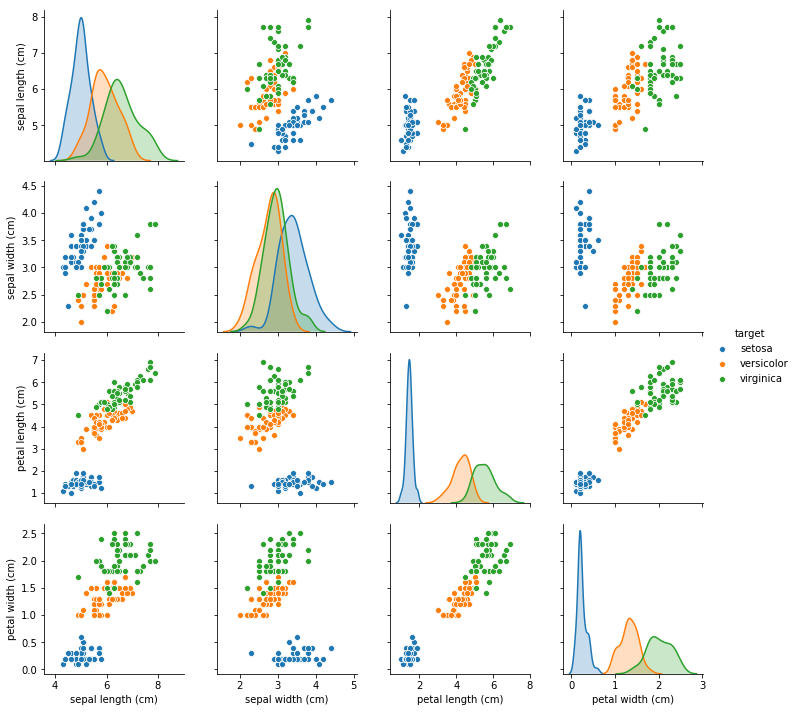

# MLP RBF

* Jahir Gilberth Medina Lopez
    - **USP# 10659682**

## Introduction

O conjunto de dados Iris tem 4 atributos diferentes e um valor objetivo com 3 classes diferentes 

* Atributos:
    - sepal length (cm)
    - sepal width (cm)
    - petal length (cm)
    - petal width (cm)
* Objetivos:
    - setosa
    - virginica
    - versicolor

(veja imagem abaixo)

## MLP

Primeiro, eu teve que normalizar os dados, fiz uso da [0-1] Normalização, depois, binarizei os objetivos, fazendo mais adequados para ser usado no MLP.

O MLP foi executado usando os seguintes hiperparâmetros:

* **sample size** : *0.75*
* **epoch** :*500*
* **eta** : *0.8*
* **momentum** : *0*
* **threshold** = *1e-7*
* **activation function** = *sigmoid*

dando o seguinte resultado

    |-----------| 
    % Train: 0.750000 Max.Iter: 500 Eta: 0.800000 Momentum: 0.000000
    % Precition (Train) :>>         97.452229
    % Precition (Test) :>>  88.679245
    |-----------|

## RBF 

Semelhante ao caso MLP, tive que normalizar os dados e binarizar os objetivos. Então, para inicializar o modelo, usei a técnica k-means como gerador de centros.

Já tendo os centros, o próximo passo foi agrupar os dados de acordo com esses centros, usando a função gaussiana como critério de proximidade (proximidade de cada centro).

Em seguida, os dados centralizados foram divididos em dados de teste e de treinamento (razão 75-25), já realizado este procedimento contínuo-se executar o classificador Adaline , como os dados de teste e treino.

O RBF foi executado usando os seguintes hiperparâmetros:

* **sample size** : *0.75*
* **K-Means Iterations** : *1000*
* **K-Means clusters** : *12*
* **K-Means threshold** : *1e-5*
* **Adaline Iterations** : *1000*
* **Adaline threshold** : *1e-5*
* **Adaline eta** : *0.1*
* **Phi Function** : *Gaussian*

dando o seguinte resultado

    |-----------|
    % Train: 0.750000 Max.Iter: 1000 Eta: 0.200000
    % Precition (Train) :>>         89.171975
    % Precition (Test) :>>  92.452830
    |-----------|