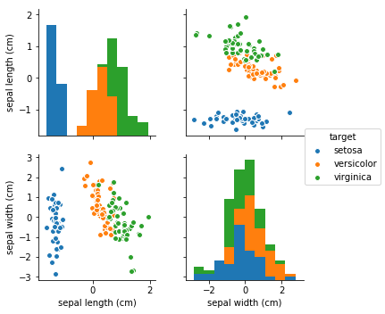
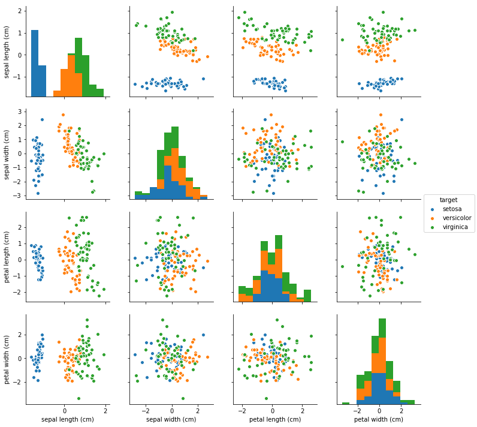

# PCA

* Jahir Gilberth Medina Lopez
    - **USP# 10659682**

## Introduction

A técnica PCA tenta encontrar os atributos (ou dimensões) mais relevantes em um conjunto de dados específico, portanto, se usarmos a técnica PCA sobre dataset algum, o resultado esperado serão duas matrices, um contém a relevância de cada parâmetro e o segundo um "matriz de conversão", que se é aplicado fazendo uso do produto ponto sobre o conjunto de dados original, obtemos um conjunto de dados reduzido do dimentional.

## PCA over Iris Data Set

**Relevance:**

|                       |  relev %      |
|:-----------------:    |:---------:    |
| sepal length (cm)     | 72.770452     |
|  sepal width (cm)     | 23.030523     |
| petal length (cm)     |  3.683832     |
|  petal width (cm)     |  0.515193     |

vamos usar apenas os 2 primeiros atributos para reduzir a dimensionalidade do conjunto de dados, porque esses 2 primeiro representam mais do que 90% da variância entre todos os atributos

### PCA over all dimensions

Mas, se optar por aplicar a matriz de conversão completa do PCA ao conjunto de dados original, o resultado talvez possa ser visto como o mesmo do original, mas fazendo mais ênfase nos atributos mais relevantes.

