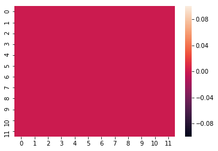
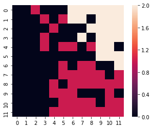
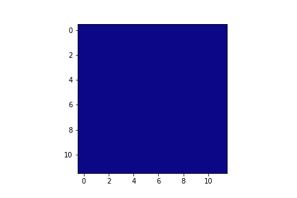

# Kohonen

* Jahir Gilberth Medina Lopez
    - **USP# 10659682**

## Introduction

Um mapa de organização auto-organizável (SOM) ou mapa de características auto-organizáveis (SOFM) é um tipo de rede neural artificial (ANN) que é treinada usando aprendizagem não supervisionada para produzir uma representação  de baixa dimensionalidade (tipicamente bidimensional). 

Um mapa de Kohonen é uma representação discretizada do espaço de entrada das amostras de treinamento, chamada de mapa, e é, portanto, um método para reduzir a dimensionalidade.

## Wine Data Set

O conjunto de dados do vinho tem 13 atributos (portanto, 13 dimensões) e 178 amostras, escolhemos compactar todos esses valores (13 x 178) em uma matriz de [12 x 12].

isto implica: as 13 dimensões originais foram compactadas em 12 dimensões e 178 amostras em 12 amostras.

É importante dizer que o conjunto de dados do vinho tem 3 classes diferentes nos dados objetivo.

### Initial Stage (SOM 12 x 12)

### Final Stage (SOM 12 x 12)

## Time Lapse

[See Online](https://imgur.com/aLH6l2y)

